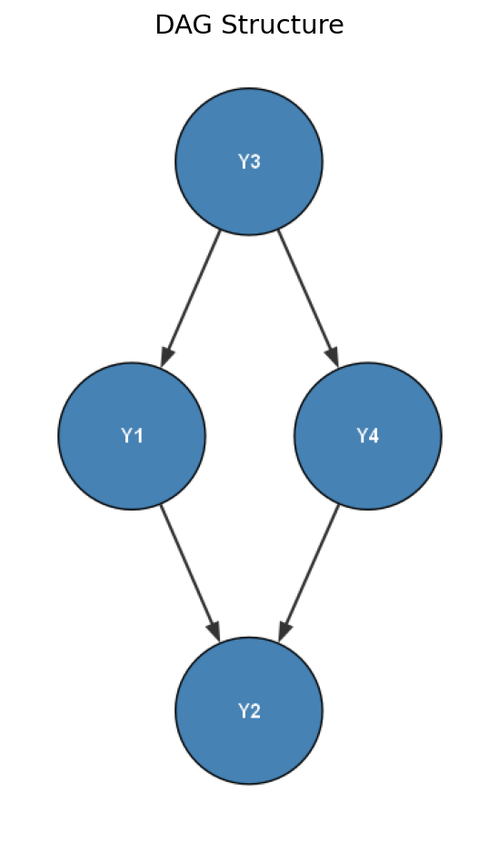
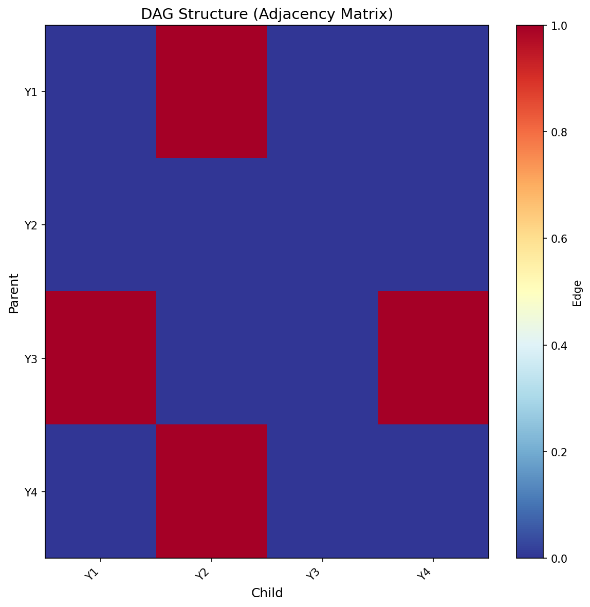
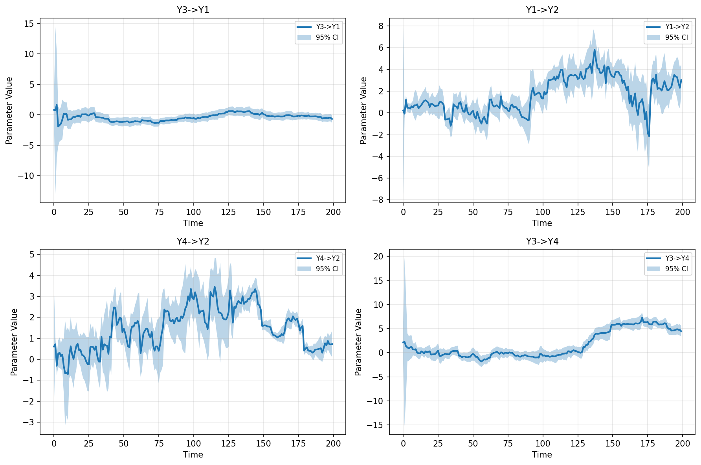
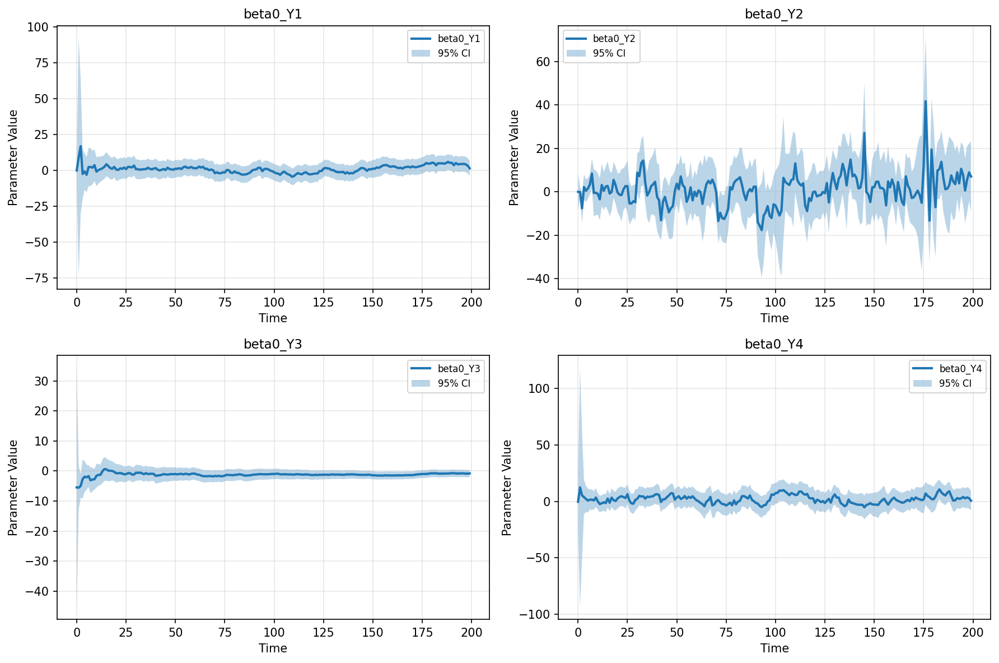
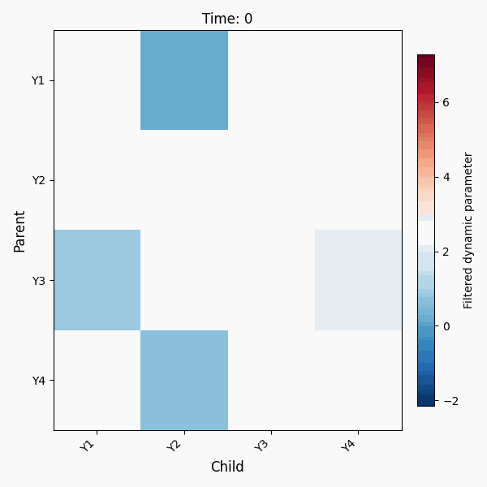
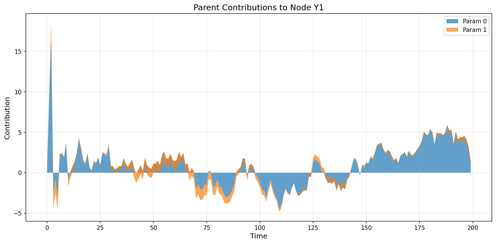
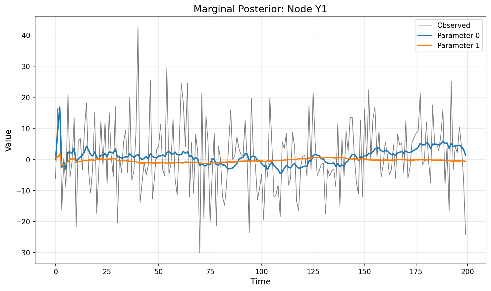
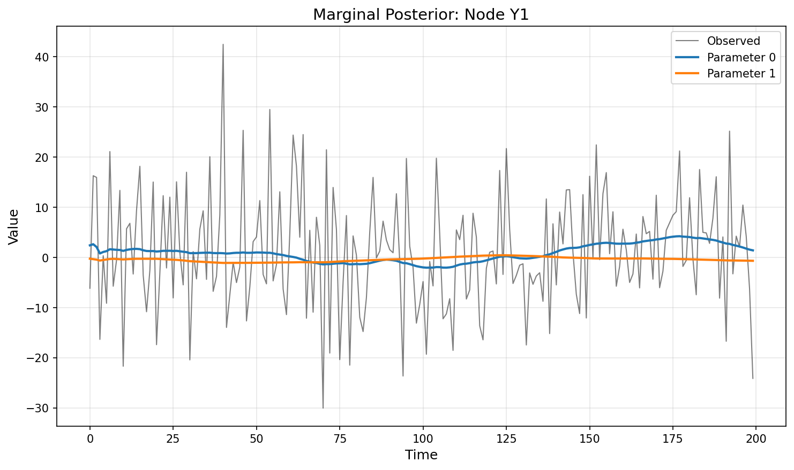

# MDMP: Bayesian Network Modeling for Dynamic Multivariate Time Series

**MDMP** is a Python package for learning Bayesian network structures from multivariate time series and estimating time-varying dynamic parameters using Kalman filtering and smoothing. It integrates structure learning algorithms including hill-climbing and tabu search with Kalman filtering and smoothing to estimate time-varying parameters for each node.

This package is a Python port of the R package **mdmr** developed by [Lilia Costa](mailto:liliacosta@ufba.br) and maintained by [Arthur R. Azevedo](mailto:arthur.rios@ufba.br).

## Features

- **Structure Learning**: Learn Bayesian network structures from multivariate time series using various algorithms (hill-climbing, tabu search, etc.)
- **Dynamic Parameter Estimation**: Estimate time-varying parameters using Kalman filtering and smoothing
- **Discount Factor Selection**: Automatically select optimal discount factors for each node
- **Visualization**: Comprehensive plotting tools for DAG structures, dynamic parameters, marginal posteriors, and animated heatmaps

## Installation

### Install from PyPI

```bash
pip install mdmp
```

### Install from GitHub

You can install directly from the GitHub repository:

```bash
pip install git+https://github.com/arzevedo/mdmp.git
```

Or install a specific branch or tag:

```bash
pip install git+https://github.com/arzevedo/mdmp.git@main
pip install git+https://github.com/arzevedo/mdmp.git@v0.6.2
```

### Install from Source (Development)

Clone the repository and install in development mode:

```bash
# Clone the repository
git clone https://github.com/arzevedo/mdmp.git
cd mdmp

# Create virtual environment (choose one method)
# Method 1: Using uv (recommended)
uv venv
source .venv/bin/activate  # On Windows: .venv\Scripts\activate
uv sync

# Method 2: Using venv
python -m venv venv
source venv/bin/activate  # On Windows: venv\Scripts\activate
pip install -e .

# Method 3: Using existing virtual environment (e.g., .venv-win)
.venv-win\Scripts\activate  # Windows
# or
source .venv/bin/activate   # Linux/Mac

# Install package in editable/development mode
pip install -e .

# Optional: Install with development dependencies
pip install -e ".[dev]"

# Optional: Install with hill-climbing support (requires pgmpy)
pip install -e ".[hc]"
```

### Install from Source (Production)

For production installation (non-editable):

```bash
git clone https://github.com/arzevedo/mdmp.git
cd mdmp

# Create and activate virtual environment
python -m venv venv
source venv/bin/activate  # On Windows: venv\Scripts\activate

# Install in production mode
pip install .
```

## Requirements

- Python >= 3.8
- numpy >= 1.20.0
- pandas >= 1.3.0
- scipy >= 1.7.0
- matplotlib >= 3.3.0
- networkx >= 2.6.0

### Optional Dependencies

- **pgmpy** (>=0.1.25): Required for hill-climbing structure learning method
- **pytest** (>=7.0.0): For running unit tests
- **pytest-cov**: For test coverage reports (development only)

## Development Setup

### Prerequisites

- Python 3.8 or higher
- Git
- (Optional) `uv` package manager for faster dependency management

### Setup Steps

1. **Clone the repository:**
   ```bash
   git clone https://github.com/arzevedo/mdmp.git
   cd mdmp
   ```

2. **Create and activate a virtual environment:**
   
   **Using `uv` (recommended):**
   ```bash
   uv venv
   source .venv/bin/activate  # Linux/Mac
   # or
   .venv\Scripts\activate     # Windows
   uv sync
   ```
   
   **Using `venv`:**
   ```bash
   python -m venv venv
   source venv/bin/activate  # Linux/Mac
   # or
   venv\Scripts\activate     # Windows
   pip install -e ".[dev]"
   ```

3. **Install the package in development mode:**
   ```bash
   pip install -e .
   ```

   Or with all development dependencies:
   ```bash
   pip install -e ".[dev]"
   ```

### Running Unit Tests

The package uses `pytest` for testing. To run all tests:

```bash
# Activate virtual environment first
source .venv/bin/activate  # Linux/Mac
# or
.venv-win\Scripts\activate  # Windows (if using .venv-win)

# Run all tests
pytest tests/ -v

# Run tests for a specific module
pytest tests/test_scoring.py -v
pytest tests/test_structure.py -v

# Run tests with coverage (if pytest-cov is installed)
pytest tests/ -v --cov=mdmp --cov-report=term-missing

# Run tests without coverage (if pytest-cov is not installed)
pytest tests/ -v -o addopts=
```

**Note:** If you encounter errors about coverage options and `pytest-cov` is not installed, use the `-o addopts=` flag to override the configuration, or install pytest-cov:

```bash
pip install pytest-cov
```

### Test Structure

The test suite includes:
- **test_dlm.py**: Tests for DLM filtering and smoothing
- **test_mdm.py**: Tests for MDM class and main functionality
- **test_scoring.py**: Tests for scoring functions and discount factor selection
- **test_structure.py**: Tests for structure learning algorithms
- **test_utils.py**: Tests for utility functions
- **test_plotting.py**: Tests for plotting functions

All tests should pass before submitting pull requests.

## Example Usage

This walkthrough demonstrates how to use `MDMP` to learn a dynamic Bayesian network and visualize the results. This example uses a multivariate time series data [200 x 4].

### 1. Load the package and sample data

```python
import numpy as np
import pandas as pd
from mdmp import MDM, plot_dag, plot_arcs, plot_marginal, plot_stream, plot_idag

# Load sample data
data = pd.read_csv("data/mdmr_test_data.csv")
print(data.head())
```

### 2. Fit the MDM model

```python
model = MDM(data_input=data, method="hc")
# Running hill-climbing with custom MDM score...
```

- `model` is an object of class `MDM` containing:
  - The inferred DAG structure (`adj_mat`)
  - Filtering and smoothing estimates (`Filt`, `Smoo`)
  - Local scores and optimization metadata
  - Available methods: `"hc"` (hill-climbing), `"tabu"` (tabu search)

---

## Visualizations

### 3.1 DAG Structure

```python
plot_dag(model, plot_type="graph")
```



> Displays the structure as a directed acyclic graph with nodes and directed edges.

- The `plot_type` argument selects the plot to display. Either `"graph"` for a directed acyclic graph with arrows or `"heatmap"` for a matrix view.

```python
plot_dag(model, plot_type="heatmap")
```



- There are other arguments to personalize the graph output like `edge_color`, `node_color`, and `node_labels`.

### 3.2 Arcs Over Time

Highlight which arcs were selected and their local scores:

```python
plot_arcs(model, plot_type="connections", distribution="filt", ci_level=0.95)
```



> Helps identify dominant parent-child relationships.

- The `plot_type` argument selects the dynamic parameters time series that are displayed.
  - `"connections"`: Plots only dynamic edge parameters (e.g., V3→V1).
  - `"intercepts"`: Plots only intercepts (e.g., beta0 terms).
  - `"all"`: Plots both intercepts and connections.

```python
plot_arcs(model, plot_type="intercepts", distribution="filt")
```



- The `distribution` argument defines whether to use filtered (`"filt"`) or smoothed (`"smoo"`) distributions. Default is `"filt"`.
- The `ci_level` argument establishes the width of the credible interval. Default is `0.95`.

### 3.3 Dynamic Heatmap Animation

Animated heatmap of posterior estimates across time:

```python
plot_idag(
    mdm_object=model,
    output_gif="my_dynamic_model.gif",
    fps=10,
    width=6,
    height=6,
    dpi=100
)
```



> Each tile represents the magnitude of a dynamic parameter at each time step. This animation captures the temporally varying intensity of connections in the network structure.

- The `mdm_object` argument requires an object of class `MDM` as returned by `MDM()`.
- `output_gif` is the name of the output file. Must end with `.gif`. Default is `"mdm_dynamic.gif"`.
- `fps` selects the frames per second for the animation. Default is `10`.
- `width` (in inches) of each frame. Default is `6`.
- `height` (in inches) of each frame. Default is `6`.
- `dpi` is the resolution (dots per inch) for saved frames. Default is `100`.

### 3.4 Stream Plot for a Node

Plot contribution of parents to the dynamic evolution of a target node:

```python
plot_stream(mdm_object=model, child_node=0, distribution="filt")
```



> Useful for assessing how different parents dynamically influence a given node.

- The `mdm_object` argument requires an object of class `MDM` as returned by `MDM()`.
- The `child_node` argument is an integer index of the target node (i.e., the child whose parents' effects are shown).
- The `distribution` argument defines whether to use filtered (`"filt"`) or smoothed (`"smoo"`) posterior estimates. Default is `"filt"`.

### 3.5 Marginal Posterior for a Node

Plot the marginal posterior means and confidence bands:

```python
plot_marginal(mdm_object=model, distribution="filt", target_node=0, scale_series=False)
```



> Shows how the coefficients associated with a node evolve over time (filtered or smoothed).

```python
plot_marginal(mdm_object=model, distribution="smoo", target_node=0, scale_series=False)
```



- The `mdm_object` argument requires an object of class `MDM` as returned by `MDM()`.
- The `target_node` argument is an integer index specifying the target node (child).
- The `distribution` argument defines whether to use filtered (`"filt"`) or smoothed (`"smoo"`) posterior estimates. Default is `"filt"`.
- The `scale_series` argument is a logical value. If `True`, all time series (observed and parental contributions) are standardized (mean zero, unit variance). Default is `False`.

---

## Main Components

### MDM Class

The main `MDM` class coordinates structure learning, discount factor selection, filtering, and smoothing:

```python
model = MDM(
    data,              # Time series data (pd.DataFrame or np.ndarray)
    method="hc",        # Structure learning method: "hc", "tabu", etc.
    nbf=15,            # Burn-in time point
    delta=None,        # Discount factor sequence (auto if None)
    verbose=True       # Print progress
)
```

**Attributes:**
- `adj_mat`: Adjacency matrix of learned DAG structure
- `data`: Original input data
- `DF`: Discount factor estimation results
- `Filt`: Filtered dynamic parameters
- `Smoo`: Smoothed dynamic parameters
- `node_names`: Names of variables/nodes

### Structure Learning Methods

By default, the `MDM()` function uses the hill-climbing algorithm to learn the structure of the Bayesian network. Other heuristic methods are also available, like tabu search.

Currently available methods:
- `"hc"`: Hill-climbing (default, fast)
- `"tabu"`: Tabu search (often finds better structures)

Future implementations may include additional structure learning algorithms.

### Plotting Functions

1. **`plot_dag()`**: Plot DAG structure as graph or heatmap
2. **`plot_arcs()`**: Plot dynamic parameters over time
3. **`plot_marginal()`**: Plot marginal posterior for a target node
4. **`plot_stream()`**: Plot parent contributions to a child node
5. **`plot_idag()`**: Create animated heatmap of dynamic parameters

## API Reference

### Core Functions

#### `mdmp.MDM`

Main model class for fitting MDM models.

#### `mdmp.dlm.dlm_filter()`

Core DLM filtering function.

#### `mdmp.dlm.dlm_smooth()`

Core DLM smoothing function.

#### `mdmp.scoring.select_discount_factors()`

Select optimal discount factors for each node.

#### `mdmp.structure.StructureLearner`

Structure learning algorithms.

## Comparison with R Package

This Python package (`mdmp`) is a port of the R package `mdmr`. The main differences:

1. **Pythonic API**: Uses Python conventions and type hints
2. **Modular Design**: Code is organized into logical modules
3. **Modern Dependencies**: Uses NumPy, Pandas, Matplotlib instead of R equivalents
4. **Structure Learning**: Currently implements hill-climbing and tabu search natively

## Documentation

Full documentation is available in the docstrings. To view:

```python
import mdmp
help(mdmp.MDM)
```

## License

GPL-3.0 (same as the original R package)

## Citation

If you use this package in your research, please cite:

```
@software{mdmp,
  title = {MDMP: Bayesian Dynamic Regression Model for Python},
  author = {Santos, Matheus Augusto Oliveira dos and Costa, Lilia and Azevedo, Arthur R.},
  version = {0.6.2},
  url = {https://github.com/arzevedo/mdmp},
  note = {Python port of the mdmr R package}
}
```

For the original R package, please cite:

```
@software{mdmr,
  title = {mdmr: Bayesian dynamic regression model (MDM)},
  author = {Costa, Lilia and Azevedo, Arthur R.},
  version = {0.6.2},
  url = {https://github.com/arzevedo/mdmr}
}
```

## Contributing

Contributions are welcome! Please open an issue or submit a pull request.

## Acknowledgments

This package is a Python port of the R package **mdmr**.

- **Original Author**: [Lilia Costa](mailto:liliacosta@ufba.br) - Creator of the MDM model and original R package implementation
- **R Package Maintainer**: [Arthur R. Azevedo](mailto:arthur.rios@ufba.br) - Maintainer of the [mdmr R package](https://github.com/arzevedo/mdmr)
- **Python Port Maintainer**: [Matheus Augusto Oliveira dos Santos](mailto:matheusaugusto@ufba.br) - Responsible for adapting and implementing the Python version

## Changelog

### 0.6.2 (Initial Release)
- Ported core functionality from R package mdmr
- Implemented DLM filtering and smoothing
- Implemented MDM structure learning (hill-climbing, tabu search)
- Implemented plotting functions
- Added comprehensive documentation

