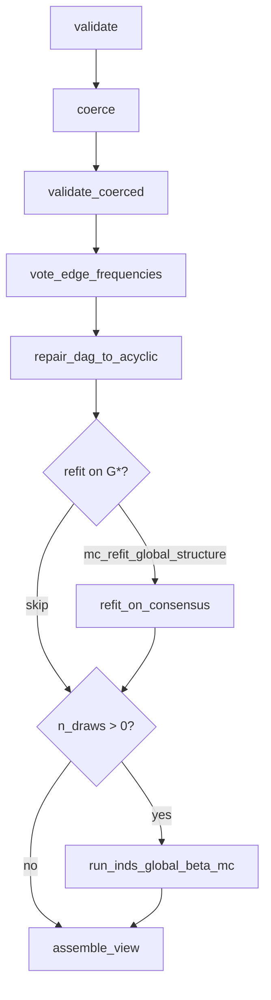
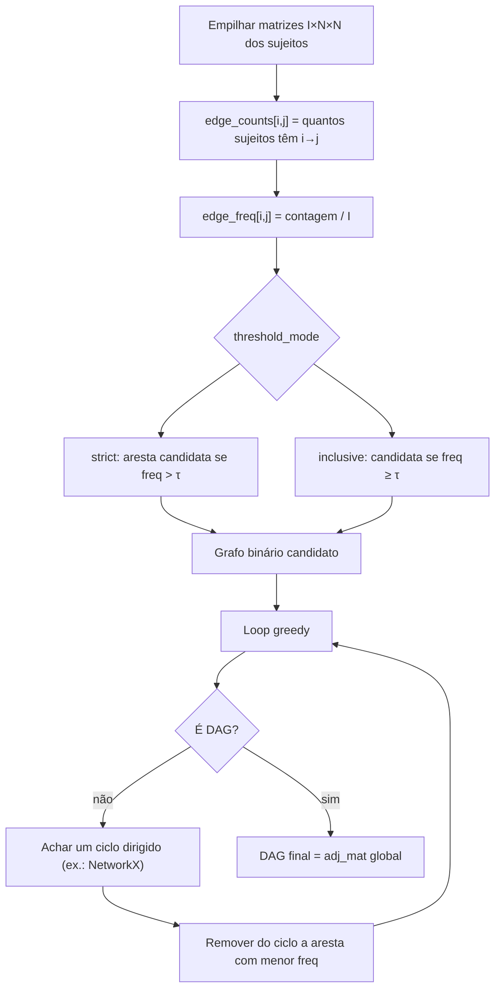
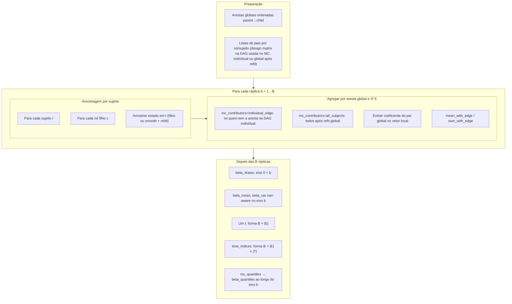
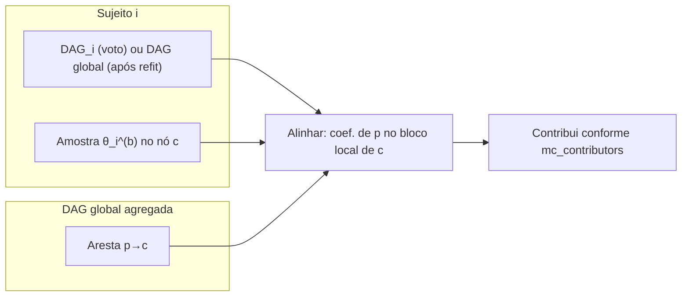

# Individual Structure (IS) aggregation — logic diagrams

## Statistical Interpretation (reference)

Before reading the diagrams, keep three distinctions in mind:

| Claim | What the code actually computes |
|---|---|
| "global effect" of edge p→c | **Conditional** mean E\[θ\|edge=1\]: only subjects expressing the edge contribute; absent subjects are excluded from both numerator and divisor |
| "posterior credible interval" | MC uncertainty from **independent** per-subject DLM posteriors; **not** a joint hierarchical posterior; no shrinkage, no between-subject covariance |
| "structural uncertainty" | G\* is **fixed** before any MC; inference is p(θ\|G\*); structural uncertainty is **not** propagated |

**Pooling semantics.**
`pooling='conditional_mean_among_edge_subjects'` (legacy alias `'mean_with_edge'`):

```
θ̄_t^(b) = (1/A) Σ_{i ∈ 𝒜} θ_{i,t}^(b)
```

where 𝒜 = subjects whose individual DAG contained edge p→c, A = |𝒜|.
This estimates E\[θ_{pc,t} | edge_{pc} = 1\], **not** the unconditional population mean (1/S) Σ_i θ_{i,t}^(b).

**Smoothed draws.**
When `mc_posterior='smoothed'`, the code uses smoothed moments (smt, sCt) together with filtered (nt, dt) at the same time index — a pragmatic approximation, not the exact full smoothing posterior.

Diagramas em [Mermaid](https://mermaid.js.org/). Pré-visualize no GitHub, VS Code (extensão Mermaid), ou [mermaid.live](https://mermaid.live).

## 1. Pipeline (`inds.pipeline.run_full`)



Split entry points: `vote_individual_structures`, `refit_on_consensus`,
`run_inds_global_beta_mc`, `pool_conditional_filtered_states`, `as_inds_mdm_view`.

## 2. Visão geral: `aggregate_individual_structures`

```mermaid
flowchart LR
  subgraph in["Entrada"]
    M["Lista: adjacências OU MDMs ajustados"]
  end

  subgraph norm["1. Normalizar"]
    N1["Um único MDM → [MDM]"]
    N2["Matriz 2D única → [adj]"]
  end

  subgraph coerce["2. Coerção MDM"]
    C1{Todos MDM-like?}
    C2["Extrair adj: (adj_mat > 0)"]
    C3["Opcional: Filt de cada m"]
    C4["Opcional: plot_data = média dos data"]
  end

  subgraph val["3. Validar"]
    V["Adj binárias N×N; node_names; plot_data (T,N)"]
  end

  subgraph vote["4. Voto + DAG"]
    Freq["Contar arestas por sujeito → frequência"]
    Thr{"threshold_mode"}
    S["strict: freq > τ"]
    I["inclusive: freq ≥ τ"]
    Cyc["Greedy: enquanto houver ciclo, remover do ciclo a aresta de menor freq"]
  end

  subgraph out["5. Saída base"]
    R["ISAggregatedMDMView: adj_mat global, metadata"]
  end

  subgraph opt["Opcional"]
    PF["pool_filt / plot_filt → Filt global para plots"]
    RF["mc_refit_global_structure → refit MDM na DAG global"]
    MC["n_draws > 0 → global_beta_mc"]
  end

  M --> norm --> coerce
  coerce --> val --> vote --> R
  Freq --> Thr
  Thr --> S
  Thr --> I
  S --> Cyc
  I --> Cyc
  Cyc --> R
  R --> PF
  R --> RF
  R --> MC
```



## 2. Voto por aresta e reparo de ciclos (greedy)

O reparo **não** calcula um conjunto mínimo global de arcos de feedback (minimum FAS): em cada iteração encontra-se **um** ciclo dirigido, remove-se a aresta desse ciclo com menor **frequência empírica** entre os sujeitos, e repete-se até obter um DAG.



## 3. Monte Carlo nos coeficientes das arestas globais

Interpretação em dois eixos:

- **Posterior por sujeito:** por defeito usa-se o **filtro** individual sob a DAG **individual**; com `mc_refit_global_structure`, primeiro corre-se o mesmo pipeline que o MDM (`refit_mdm_on_structure`) com a DAG global fixa, obtendo posteriores **à estrutura global**.
- **Fonte temporal:** `mc_posterior='filtered'` amostra `(mt, Ct, nt, dt)`; `'smoothed'` usa `(smt, sCt)` do smooth com `nt, dt` do filtro no mesmo instante (reutilização da rotina de amostragem tipo *t*).



## 4. DAG individual × DAG global (MC)



## Referência no código

- Orquestração: `aggregate_individual_structures` em `aggregation.py`
- Voto + ciclos: `_vote_threshold_and_repair_cycles`, `_remove_lowest_freq_cycle_edge`
- Refit estrutura fixa: `mdmp.model.refit_mdm_on_structure`
- MC: `_monte_carlo_global_edge_beta`, `_monte_carlo_beta_draws_at_time`, `_sample_dlm_state_posterior`
- Filt agregado para plots: `build_plot_filt_from_subjects`
