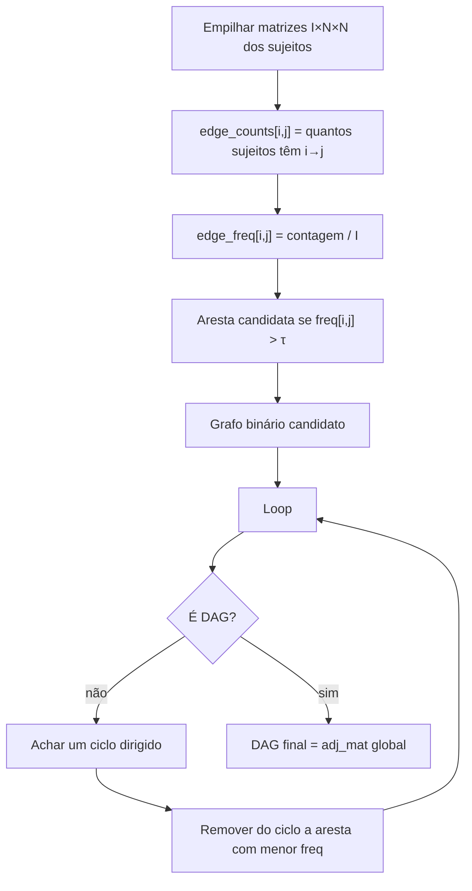
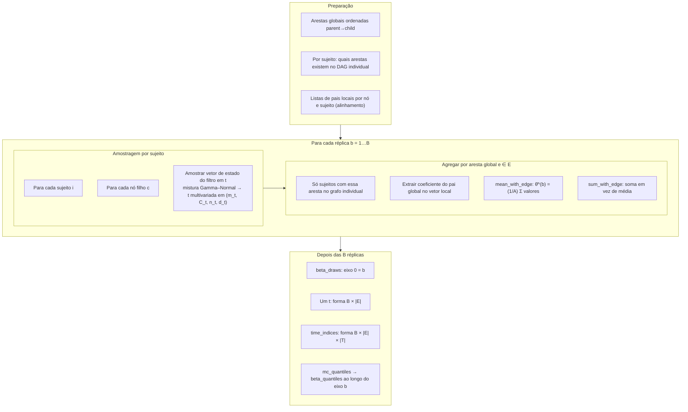
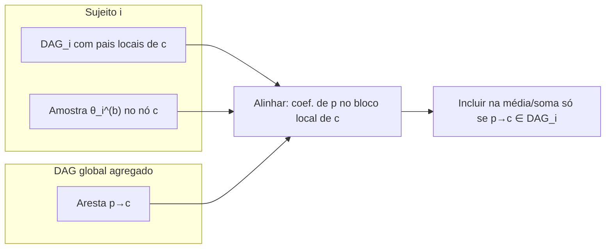

# Individual Structure (IS) aggregation — logic diagrams

Diagramas em [Mermaid](https://mermaid.js.org/). Pré-visualize no GitHub, VS Code (extensão Mermaid), ou [mermaid.live](https://mermaid.live).

## 1. Visão geral: `aggregate_individual_structures`

```mermaid
flowchart LR
  subgraph in["Entrada"]
    M["Lista: adjacências OU MDMs ajustados"]
  end

  subgraph norm["1. Normalizar"]
    N1["Um único MDM → [MDM]"]
    N2["Matriz 2D única → [adj]"]
  end

  subgraph coerce["2. Coerção MDM"]
    C1{Todos MDM-like?}
    C2["Extrair adj: (adj_mat > 0)"]
    C3["Opcional: Filt de cada m"]
    C4["Opcional: plot_data = média dos data"]
  end

  subgraph val["3. Validar"]
    V["Adj binárias N×N; node_names; plot_data (T,N)"]
  end

  subgraph vote["4. Voto + DAG"]
    Freq["Contar arestas por sujeito → frequência"]
    Thr["Manter aresta se freq > τ"]
    Cyc["Enquanto houver ciclo: remover aresta do ciclo com menor freq"]
  end

  subgraph out["5. Saída base"]
    R["ISAggregatedMDMView: adj_mat global, metadata"]
  end

  subgraph opt["Opcional"]
    PF["pool_filt / plot_filt → Filt global para plots"]
    MC["n_draws > 0 → global_beta_mc"]
  end

  M --> norm --> coerce
  coerce --> val --> vote --> R
  R --> PF
  R --> MC
```

## 2. Voto por aresta e reparo de ciclos

## 3. Monte Carlo nos coeficientes das arestas globais

## 4. DAG individual × DAG global (MC)

## Referência no código

- Orquestração: `aggregate_individual_structures` em `aggregation.py`
- Voto + ciclos: `_vote_threshold_and_repair_cycles`, `_remove_lowest_freq_cycle_edge`
- MC: `_monte_carlo_global_edge_beta`, `_monte_carlo_beta_draws_at_time`, `_sample_dlm_state_posterior`
- Filt agregado para plots: `build_plot_filt_from_subjects`
